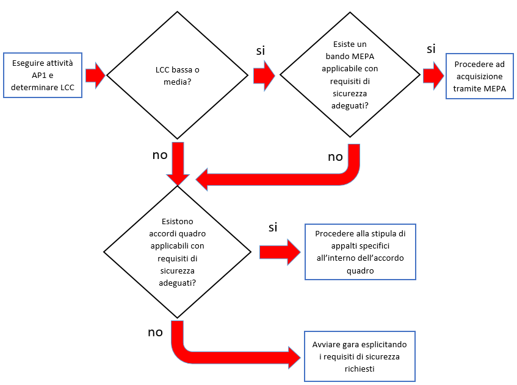

Indicazioni per le amministrazioni
==================================

Il presente paragrafo contiene indicazioni, in termini di azioni da eseguire,
che le pubbliche amministrazioni devono prendere in considerazione per le
finalità di cui al 1.3. Alcune azioni sono di tipo organizzativo, altre
funzionali, altre ancora di tipo operativo.

Il paragrafo è strutturato in 3 sotto paragrafi, che classificano le indicazioni
fornite secondo il seguente criterio temporale:

- azioni da svolgere prima dell’acquisizione (prima della fase di procurement);

- azioni da svolgere nel corso del procedimento di acquisizione (durante la
fase di procurement);

- azioni da svolgere dopo la stipula del contratto.

Le indicazioni fornite sono da ritenersi obbligatorie per le forniture ritenute
critiche dall’amministrazione committente (vedi par. 2.1.2.1), mentre devono
essere intese come semplici suggerimenti, da attuarsi compatibilmente con le
risorse disponibili e in misura adeguata alle dimensioni - in termini di
investimenti finanziari - del contratto stesso, per forniture non critiche. Nel
documento verranno forniti criteri per classificare le forniture come “critiche”
o “non critiche”.

Azioni da svolgere prima della fase di procurement
--------------------------------------------------

Prima di attivare un procedimento di acquisizione, le amministrazioni devono
aver svolto una serie di azioni di carattere generale e strategico, non legate
alla singola acquisizione, per “prepararsi” a effettuare i successivi passi in
maniera sicura. In estrema sintesi, le amministrazioni devono organizzarsi,
dotarsi di strumenti, metodologie e competenze, definire una politica da
seguire, stabilire regole, criteri, piani d’azione che poi utilizzeranno in fase
di procurement. Detto in altri termini, si tratta di strutturare e formalizzare
i futuri procedimenti di acquisizione, minimizzando il rischio di trovarsi -
nell’operatività - in situazioni inaspettate e dover poi “improvvisare”.

Per facilità di lettura, le azioni da svolgere vengono, qui nel seguito,
enumerate da AG1 ad AG7 (l’acronimo AG sta per “azioni generali”). Si sottolinea
che le amministrazioni non devono considerare queste azioni come ulteriori
impegni rispetto ai normali procedimenti o un aggravio di complessità degli
stessi. Al contrario, la maggior parte di queste azioni sono prassi che le
amministrazioni dovrebbero già aver svolto per altri obiettivi: si tratta quindi
di verificare e sanare eventuali carenze anche, ma non solo, per assicurare la
sicurezza nel procurement ICT.

AG1 - Promuovere competenza e consapevolezza
~~~~~~~~~~~~~~~~~~~~~~~~~~~~~~~~~~~~~~~~~~~~

È necessario che le amministrazioni possano disporre, tra le risorse umane che
si occuperanno delle acquisizioni, di competenze aggiornate di Procurement
Management, Gestione Progetti, Asset Management, Change Management, Risk
Management, Sicurezza e Protezione dei Dati.

Ove le amministrazioni intendano mantenere internamente le competenze di cui
sopra, occorre che il personale individuato venga formato attraverso opportuni
percorsi didattici e di aggiornamento (ad esempio, una serie strutturata di
corsi sui temi elencati). Una scelta alternativa, ove sia indisponibile
personale interno, è acquisire queste conoscenze dal mercato, facendo ricorso a
società di supporto e consulenza specifica.

Allo stesso tempo, occorre che le amministrazioni mantengano al loro interno un
adeguato livello di consapevolezza sulla tematica della sicurezza nel
procurement ICT. Ciò si ottiene, ad esempio, organizzando eventi tematici,
seminari e presentazioni sui rischi della“non-sicurezza” (cosa potrebbe accadere
se...), destinati non solo alle risorse direttamente coinvolte nelle
acquisizioni, ma ai decisori e più in generale a tutto il personale. Si
suggerisce di inserire questo tipo di eventi nella normale attività di
comunicazione dell’amministrazione verso i dipendenti (ad esempio, nel
calendario della formazione obbligatoria sulla sicurezza dei luoghi di lavoro e
sulla privacy).

AG2 - Raccogliere buone prassi ed esperienze
~~~~~~~~~~~~~~~~~~~~~~~~~~~~~~~~~~~~~~~~~~~~

È opportuno che l’amministrazione raccolga al proprio interno notizie sui casi
di successo/insuccesso, in termini di sicurezza, riscontrati nelle precedenti
acquisizioni ICT, come buone prassi da tenere in conto al fine di un
miglioramento continuo del processo di procurement. A livello più generale e
inter-amministrazione, la raccolta di casi di successo e buone prassi può essere
svolta da un soggetto centrale, vedi paragrafo 2.2.2.

L’amministrazione deve inoltre organizzarsi per essere in grado di ricevere e
diffondere al proprio interno eventuali avvisi e allarmi provenienti da gruppi
specialistici, associazioni professionali che si occupano di sicurezza delle
informazioni e che presidiano anche altri contesti (ad esempio il CERT-PA).

AG3 - Stabilire ruoli e responsabilità
~~~~~~~~~~~~~~~~~~~~~~~~~~~~~~~~~~~~~~

Le amministrazioni devono definire, all’interno della propria struttura, ruoli e
responsabilità connesse con la sicurezza del procurement ICT, identificando
profili idonei e assegnando incarichi formali.

Come strumento operativo, si suggerisce di utilizzare matrici di tipo RACI-VS
per mettere in relazione i ruoli definiti con le attività da svolgere nel corso
dell’acquisizione e posteriormente alla stessa.

Nella tabella che segue si forniscono alcuni esempi, di tipo meramente
esplicativo (servono solo per spiegare come usare, in questo contesto, le
matrici RACI-VS). Sulle righe sono elencate le azioni suggerite in questo
capitolo, mentre sulle colonne sono riportati alcuni ruoli tipici.

NB: i ruoli nominati in tabella non sono rappresentativi; nei casi reali di
specifiche amministrazioni alcuni ruoli potrebbero non essere definiti, due o
più ruoli potrebbero coincidere tra loro, o essere presenti con nomi diversi.

.. table:: Matrice RACI-VS di esempio
   :name: matrice-raci-vs-esempio

   +---------------+------------------------------------------------------------------------------------------------------------------------------------------------+
   |               | Ruoli                                                                                                                                          |
   +===============+==============+==============+==============+==============+==============+==============+==============+==============+============+===========+
   | Codice Azione | Responsabile | Responsabile | Responsabile | Responsabile | Responsabile | Responsabile | Responsabile | Verificatore | Direttore  | Direttore |
   | / Ruoli       | Asset - ICT  | Sicurezza -  | Area ICT     | Procurement  | Area         | Audit        | Area Audit   | Esterno      | Esecuzione | Generale  |
   |               |              | ICT          |              | ICT          | Acquisizioni |              |              |              | Contratto  |           |
   +---------------+--------------+--------------+--------------+--------------+--------------+--------------+--------------+--------------+------------+-----------+
   | AG2           | C            | C            | I            | R            | A            | I            | I            | V            |            | S         |
   +---------------+--------------+--------------+--------------+--------------+--------------+--------------+--------------+--------------+------------+-----------+
   | AG4           | R            | C            | A            | I            | I            | I            | I            | V            |            | S         |
   +---------------+--------------+--------------+--------------+--------------+--------------+--------------+--------------+--------------+------------+-----------+
   | AG5           | C            | R            | A            | I            | I            | I            | I            | V            |            | S         |
   +---------------+--------------+--------------+--------------+--------------+--------------+--------------+--------------+--------------+------------+-----------+
   | AG6           | C            | C            | I            | I            | I            | R            | A            | V            | S          |           |
   +---------------+--------------+--------------+--------------+--------------+--------------+--------------+--------------+--------------+------------+-----------+
   | AP1           | C            | C            | C            | R            | A            | I            | I            | V            | S          |           |
   +---------------+--------------+--------------+--------------+--------------+--------------+--------------+--------------+--------------+------------+-----------+
   | AP2           | C            | C            | C            | R            | A            | I            | I            | V            | S          |           |
   +---------------+--------------+--------------+--------------+--------------+--------------+--------------+--------------+--------------+------------+-----------+
   | A2            | C            | R            | A            | I            | I            | I            | I            | V            | S          |           |
   +---------------+--------------+--------------+--------------+--------------+--------------+--------------+--------------+--------------+------------+-----------+

R = Responsible: persona (o ruolo) che produce il risultato dell’attività.

A = Accountable: persona (o ruolo) che approva il risultato.

C = Consult: persona (o ruolo) che viene consultata nella produzione del
risultato.

I = Inform: persona o il ruolo che viene informata sul risultato.

V = Verifier: persona o il ruolo che verifica che il risultato rispetti i
criteri di accettazione.

S = Signatory: persona o il ruolo che approva la decisione del Verifier.

AG4 - Effettuare una ricognizione dei beni informatici e dei servizi
~~~~~~~~~~~~~~~~~~~~~~~~~~~~~~~~~~~~~~~~~~~~~~~~~~~~~~~~~~~~~~~~~~~~

L’amministrazione deve disporre di un inventario aggiornato dei propri beni
informatici (nel seguito, “asset”). Ove questo inventario non sia disponibile o
sia ritenuto incompleto/inaffidabile/obsoleto, l’amministrazione deve effettuare
una ricognizione (questa attività è definita “assessment”) dei beni quali – a
titolo di esempio - apparecchiature hardware, applicazioni, licenze d’uso, ecc.

L’inventario deve contenere, per ogni bene, il responsabile (definito“owner”) in
termini di protezione dei requisiti generali di sicurezza (Riservatezza,
Integrità, Disponibilità, Non Ripudio, Autenticità).

Si suggerisce, ove non già presente o sia ritenuto non aggiornato, di costituire
un analogo inventario anche dei servizi che l’amministrazione eroga al suo
interno e nei confronti dei suoi utenti istituzionali (cittadini, imprese).
Sarebbe utile anche una relazione tra i due inventari, ad esempio quali beni
informatici sono utilizzati per erogare quali servizi. I due inventari devono
essere oggetto di una sistematica manutenzione e aggiornamento.

Come già detto, l’utilità di questa azione esula dalla mera tematica della
sicurezza nel procurement ICT. Pertanto, l’investimento necessario, in termini
di giorni persona, per svolgere questa azione viene ripagato da benefici ben
superiori alla sola sicurezza (si pensi, ad esempio, alla facilità di gestione
di asset correttamente inventariati, oppure alla possibilità, a valle
dell’assessment, di ottimizzare il parco licenze riducendone i costi).

AG5 - Classificazione di beni e servizi sotto il profilo della sicurezza
~~~~~~~~~~~~~~~~~~~~~~~~~~~~~~~~~~~~~~~~~~~~~~~~~~~~~~~~~~~~~~~~~~~~~~~~

Successivamente all’azione AG4, l’amministrazione deve classificare i beni e i
servizi individuati in termini di criticità, rischi, minacce, vulnerabilità. A
tale scopo, ove non siano già state svolte per altri obiettivi,
l’amministrazione deve eseguire le attività di Risk Assessment e di Business
Impact Analisys. Per un approfondimento su queste attività, si rimanda alla
consultazione dei seguenti documenti di riferimento (Rif: DR-1 – DR-2 – DR-3)
del paragrafo 1.5.

Anche questa classificazione va mantenuta aggiornata, eventualmente ripetendo RA
e BIA quando l’amministrazione giudichi obsoleti gli ultimi studi condotti (ad
esempio a valle di un evento che cambi le condizioni operative
dell’amministrazione).

AG6 - Definire una metodologia di audit e valutazione del fornitore in materia di sicurezza
~~~~~~~~~~~~~~~~~~~~~~~~~~~~~~~~~~~~~~~~~~~~~~~~~~~~~~~~~~~~~~~~~~~~~~~~~~~~~~~~~~~~~~~~~~~

Le amministrazioni devono organizzarsi in modo da poter svolgere efficaci azioni
di audit nei confronti dei propri fornitori, anche individuando al loro interno
competenze e responsabilità. Devono definire il processo e le modalità di
svolgimento delle attività di audit: processo e modalità devono essere
esplicitate nei capitolati di gara o nei contratti di fornitura, come
dettagliato nel successivo paragrafo 2.1.2.

Tra le modalità da definire, occorre stabilire almeno:

- gli obiettivi del processo di audit (tra questi, nelle forniture
  critiche sotto l’aspetto della sicurezza, c’è l’obiettivo di verificare le
  misure di sicurezza adottate dal fornitore nell’erogazione delle sue
  prestazioni);

- la periodicità con la quale verranno eseguiti gli audit;

- gli indicatori, metodi e misure che saranno utilizzati, anche con
  riferimento all’oggettività dei risultati dell’audit.

Gli indicatori, metodi e misure di cui all’ultimo punto potranno essere
utilizzati anche per valutare il fornitore, sotto il profilo della sicurezza,
nelle procedure di acquisizione che l’amministrazione dovrà gestire (si veda il
paragrafo 2.1.2).

AG7 - Definire una metodologia di audit interno in materia di sicurezza
~~~~~~~~~~~~~~~~~~~~~~~~~~~~~~~~~~~~~~~~~~~~~~~~~~~~~~~~~~~~~~~~~~~~~~~

In coerenza con l’azione precedente, le amministrazioni devono organizzarsi
anche per effettuare audit interni, che avranno l’obiettivo di verificare la
corretta adozione, nel tempo, di tutte le misure di sicurezza e la conformità
alle normative vigenti in materia (ad esempio il GDPR).

Check list delle azioni generali
~~~~~~~~~~~~~~~~~~~~~~~~~~~~~~~~

Uno strumento operativo molto semplice che si propone alle amministrazioni è la
seguente tabella. Rispondendo alle domande della tabella, l’amministrazione può
verificare a che livello di preparazione si trova nel contesto della sicurezza
nel procurement ICT (ad esempio confrontando la somma delle risposte rispetto al
massimo possibile), e quali azioni deve ancora compiere per migliorare la sua
posizione. Un raffinamento di questo strumento si ottiene imputando a ciascuna
domanda un peso differente a seconda dell’importanza di ciascuna azione nel
contesto dell’amministrazione.

.. table:: Check list delle azioni generali
   :name: check-list-azioni-generali

   +-----------------------+-----------------------+-----------------------+
   | Azione                | Domande               | Risposte              |
   |                       |                       |                       |
   |                       |                       | Si (1), No (0),       |
   |                       |                       | Parziale(0,5)         |
   +=======================+=======================+=======================+
   | AG1                   | Esiste un piano       |                       |
   |                       | aggiornato di         |                       |
   |                       | formazione sui temi   |                       |
   |                       | della sicurezza?      |                       |
   |                       +-----------------------+-----------------------+
   |                       | È definito un         |                       |
   |                       | calendario di eventi  |                       |
   |                       | per sensibilizzare il |                       |
   |                       | personale sui rischi  |                       |
   |                       | della “non            |                       |
   |                       | sicurezza”?           |                       |
   +-----------------------+-----------------------+-----------------------+
   | AG2                   | Esiste un archivio di |                       |
   |                       | buone prassi ed       |                       |
   |                       | esperienze?           |                       |
   +-----------------------+-----------------------+-----------------------+
   | AG3                   | Sono formalizzati gli |                       |
   |                       | incarichi e le        |                       |
   |                       | responsabilità sulla  |                       |
   |                       | sicurezza nelle       |                       |
   |                       | acquisizioni?         |                       |
   |                       +-----------------------+-----------------------+
   |                       | Sono definite matrici |                       |
   |                       | RACI-VS per le        |                       |
   |                       | attività di gestione  |                       |
   |                       | della sicurezza nelle |                       |
   |                       | acquisizioni?         |                       |
   +-----------------------+-----------------------+-----------------------+
   | AG4                   | Esiste un inventario  |                       |
   |                       | aggiornato dei beni   |                       |
   |                       | informatici           |                       |
   |                       | dell’amministrazione? |                       |
   |                       +-----------------------+-----------------------+
   |                       | Esiste un inventario  |                       |
   |                       | aggiornato dei        |                       |
   |                       | servizi erogati       |                       |
   |                       | dall’amministrazione? |                       |
   +-----------------------+-----------------------+-----------------------+
   | AG5                   | Sono disponibili      |                       |
   |                       | studi aggiornati di   |                       |
   |                       | RA e BIA nell’ambito  |                       |
   |                       | dell’amministrazione? |                       |
   +-----------------------+-----------------------+-----------------------+
   | AG6                   | È definita una        |                       |
   |                       | metodologia di audit  |                       |
   |                       | dei fornitori sul     |                       |
   |                       | tema della sicurezza? |                       |
   +-----------------------+-----------------------+-----------------------+
   | AG7                   | È definita una        |                       |
   |                       | metodologia di audit  |                       |
   |                       | interno sul tema      |                       |
   |                       | della sicurezza?      |                       |
   +-----------------------+-----------------------+-----------------------+
   | Valutazione           | (somma punteggi)      |                       |
   | complessiva           |                       |                       |
   +-----------------------+-----------------------+-----------------------+

Azioni da svolgere durante la fase di procurement
-------------------------------------------------

In questo paragrafo vengono elencate le azioni che le amministrazioni devono
compiere, sul tema della gestione della sicurezza, nel corso del procedimento di
acquisizione, che comprende anche la scrittura della documentazione di gara.

Rispetto alle azioni precedenti, che erano generali e di tipo
strategico-organizzativo, queste azioni sono operative, dipendono dalle
caratteristiche della singola acquisizione (sia per l’oggetto della fornitura
che per il procedimento di acquisizione), e in alcuni casi sono alternative tra
loro.

Le azioni da seguire sono illustrate nei paragrafi che seguono, che forniscono
anche casi d’uso pratici, riferimenti ed esempi. Le azioni sono denominate AP1 –
AP4, ove AP è acronimo per “azioni procurement”.

AP1 - Analizzare la fornitura e classificarla in base a criteri di sicurezza
~~~~~~~~~~~~~~~~~~~~~~~~~~~~~~~~~~~~~~~~~~~~~~~~~~~~~~~~~~~~~~~~~~~~~~~~~~~~

Quando sorge una necessità di acquisire beni o servizi ICT, le amministrazioni
devono determinare il livello di criticità dell’acquisizione in esame. Per fare
ciò, l’amministrazione deve verificare anzitutto su quali beni e servizi avrà
impatto l’acquisizione in esame (con riferimento alla classificazione di cui al
paragrafo 2.1.1.5). Si noti che “avere impatto” non significa solo che
l’acquisizione determina una modifica sul bene o sul servizio, ma anche - ad
esempio - che l’acquisizione è funzionale al mantenimento in operatività del
bene o servizio in questione.

In generale, la criticità del bene o servizio impattato si riflette sulla
criticità dell’acquisizione. Ad esempio, ove l’acquisizione impatti su un
servizio pubblico erogato dall’amministrazione ai cittadini, oppure su un bene e
servizio richiesto da norme di carattere generale o speciale, l’acquisizione
dovrà essere considerata critica. Possono tuttavia essere definiti altri
criteri, ad esempio:

- la dimensione complessiva in termini finanziari dell’acquisizione (un
  possibile criterio è definire “critiche” le acquisizioni di importo oltre una
  certa soglia);

- la durata temporale del contratto da stipulare (anche in questo caso,
  si potrebbero definire “critiche” le acquisizioni di durata oltre una certa
  soglia)

- la sede ove verrà installato il bene da acquisire o saranno erogate
  le prestazioni del fornitore (ad esempio, se è necessario consentire al
  fornitore di accedere a locali ove si svolgono attività critiche
  dell’amministrazione, oppure ove sono conservati informazioni critiche).

Uno strumento operativo molto semplice che si propone alle amministrazioni è la
seguente tabella. L’amministrazione deve attribuire, tramite i pesi di colonna
2, l’importanza di ciascuna domanda, aggiungere eventuali righe per ulteriori
criteri (altro), rispondere e calcolare la criticità complessiva
dell’acquisizione.

Come semplificazione, si può pensare di riportare la criticità complessiva a una
scala a tre valori “alta”, “media”,“bassa”, confrontando il risultato del
calcolo con il massimo valore possibile.

.. table:: Calcolo criticità dell'acquisizione
   :name: calcolo-criticita-acquisizione

   +-----------------+-----------------+-----------------+-----------------+
   | Domande         | Peso            | Risposte        | Punteggi pesati |
   |                 |                 |                 | (prodotto delle |
   |                 | (da definire a  | Si (1), No (0), | precedenti due  |
   |                 | cura            | Parzialmente    | colonne)        |
   |                 | dell’amministra | (0,5)           |                 |
   |                 | zione)          |                 |                 |
   +=================+=================+=================+=================+
   | L’acquisizione  | esempio: 5      |                 |                 |
   | impatta su beni |                 |                 |                 |
   | e/o servizi     |                 |                 |                 |
   | critici         |                 |                 |                 |
   | dell’amministra |                 |                 |                 |
   | zione?          |                 |                 |                 |
   +-----------------+-----------------+-----------------+-----------------+
   | L’importo, o    | esempio: 2      |                 |                 |
   | più in generale |                 |                 |                 |
   | l’investimento  |                 |                 |                 |
   | complessivo     |                 |                 |                 |
   | dell’acquisizio |                 |                 |                 |
   | ne              |                 |                 |                 |
   | supera la       |                 |                 |                 |
   | soglia minima   |                 |                 |                 |
   | di criticità?   |                 |                 |                 |
   +-----------------+-----------------+-----------------+-----------------+
   | La durata del   | esempio: 1      |                 |                 |
   | contratto da    |                 |                 |                 |
   | stipulare       |                 |                 |                 |
   | supera la       |                 |                 |                 |
   | soglia minima   |                 |                 |                 |
   | di criticità?   |                 |                 |                 |
   +-----------------+-----------------+-----------------+-----------------+
   | La sede ove     | esempio: 3      |                 |                 |
   | verranno        |                 |                 |                 |
   | erogate le      |                 |                 |                 |
   | prestazioni da  |                 |                 |                 |
   | acquisire è     |                 |                 |                 |
   | critica?        |                 |                 |                 |
   +-----------------+-----------------+-----------------+-----------------+
   | Altro (da       |                 |                 |                 |
   | definire...)    |                 |                 |                 |
   +-----------------+-----------------+-----------------+-----------------+
   | Criticità       |                 |                 |                 |
   | complessiva     |                 |                 |                 |
   +-----------------+-----------------+-----------------+-----------------+

AP2 - Scegliere lo strumento di acquisizione più adeguato, tenendo conto della sicurezza
~~~~~~~~~~~~~~~~~~~~~~~~~~~~~~~~~~~~~~~~~~~~~~~~~~~~~~~~~~~~~~~~~~~~~~~~~~~~~~~~~~~~~~~~

L’amministrazione deve tenere conto dei risultati dell’azione AP1 per scegliere
lo strumento di acquisizione di cui avvalersi, tra quelli disponibili e in
accordo con il codice degli appalti e il resto della normativa applicabile.

A titolo di mero esempio, l’amministrazione potrebbe effettuare acquisizioni di
bassa criticità sul MEPA, o comunque verificando che il bando MEPA di
riferimento contenga requisiti di sicurezza adeguati all’acquisizione da
effettuare.

Al contrario, per acquisizioni classificate di alta criticità, l’amministrazione
potrebbe ad esempio verificare che eventuali accordi quadro disponibili (come
oggetto e capienza) prevedano requisiti di sicurezza adeguati per quel grado di
criticità: in caso la verifica sia negativa, l’amministrazione potrebbe scartare
l’opzione di servirsi del suddetto accordo quadro. NB: occorre ricordare che,
per la loro stessa natura, gli accordi quadro sono strumenti di tipo
“generalista”, pertanto potrebbero contenere requisiti di sicurezza adeguati
alla maggioranza dei casi ma non per specifiche iniziative dell’amministrazione.

Come esempio esplicativo, nella figura che segue è riportata una possibile
applicazione dell’azione AP2, dove LCC sta per “livello di criticità
complessiva” della fornitura. Si ribadisce che si tratta di un mero esempio e
non di regole generali.

   Esempio di azione AP2

AP3 - Scegliere i requisiti di sicurezza da inserire nel capitolato
~~~~~~~~~~~~~~~~~~~~~~~~~~~~~~~~~~~~~~~~~~~~~~~~~~~~~~~~~~~~~~~~~~~

Ove l’amministrazione, a seguito dell’azione AP2, abbia scelto di procedere
tramite gara, essa deve inserire nel capitolato gli opportuni requisiti di
sicurezza, differenziando i requisiti che l’offerta del fornitore deve prevedere
obbligatoriamente (mandatori) da quelli opzionali, che determinano eventualmente
un premio nel punteggio tecnico. L’amministrazione dovrà tener conto anche dei
requisiti di sicurezza quando sceglierà gli indicatori di qualità e le penali da
inserire nel contratto.

Alcuni requisiti di sicurezza sono indipendenti dalla tipologia di acquisizione,
e riguardano ad esempio:

- gli aspetti “minimi” di sicurezza del bene e/o servizio da acquisire
  (riferimento DR-6).

- le obbligazioni cui i fornitori devono attenersi per poter operare
  all’interno del perimetro di sicurezza dell’amministrazione (ad esempio
  standard di riservatezza per la gestione delle informazioni/dati da parte del
  fornitore; specifici standard sul trattamento di dati personali ai sensi del
  GDPR);

- le obbligazioni per rendere possibile ed efficace il monitoraggio
  della fornitura;

- le obbligazioni per rendere possibile ed efficace attività di audit
  (vedi paragrafo 2.1.1.7).

Altri requisiti di sicurezza sono invece specifici delle diverse tipologie di
fornitura, in particolare sono connessi al bene o prestazione da acquisire. Si
rimanda all’appendice A – Requisiti di sicurezza eleggibili, che contiene un
elenco (non esaustivo ma valido per la maggior parte delle forniture pubbliche)
di requisiti di sicurezza. Si raccomanda alle amministrazioni di attingere da
questo elenco, piuttosto che scrivere ex-novo il testo dei propri requisiti di
sicurezza, anche per omogeneizzare i vari capitolati pubblici e favorire un
lessico comune tra committenti e fornitori.

Sarà cura di AGID (vedi paragrafo 3.1) estendere e aggiornare l’elenco dei
requisiti anche tenendo presente eventuali segnalazioni di incompletezza, errori
o obsolescenza che giungeranno dalle amministrazioni.

AP4 - Garantire competenze di sicurezza nella commissione di valutazione
~~~~~~~~~~~~~~~~~~~~~~~~~~~~~~~~~~~~~~~~~~~~~~~~~~~~~~~~~~~~~~~~~~~~~~~~

Nel caso di gara, l’amministrazione deve tenere conto, nella scelta delle
commissioni giudicatrici, dell’esigenza che almeno uno dei commissari abbia
competenze in tema di sicurezza. Questa raccomandazione vale soprattutto nelle
acquisizioni classificate “critiche” a seguito dell’azione AP1.

La necessità che la commissione abbia competenze specifiche sulla sicurezza,
comunque, può essere mitigata scrivendo i requisiti di sicurezza in maniera
chiara, oggettiva e quanto più possibile “chiusa”, vale a dire lasciando meno
spazio possibile all’offerta tecnica del fornitore e – di conseguenza – alla
valutazione soggettiva della commissione.

Ove l’amministrazione affidi lo svolgimento della gara a una centrale di
committenza, sarà quest’ultima a dover svolgere l’azione AP4. La disponibilità,
presso le centrali di committenza locali, di competenze sul tema sicurezza è uno
dei criteri per la scelta dell’affidamento.

Si rammenta che il Codice dei Contratti (D.Lgs. 50/2016 e s.m.i.) prevede,
all’articolo 77, che i componenti della commissione giudicatrice, per gare che
si aggiudicano con il criterio dell’offerta economicamente più vantaggiosa,
siano iscritti all’Albo nazionale gestito dall’ANAC, di cui all’articolo 78 del
Codice stesso.

Secondo la delibera ANAC n. 648 del 18 luglio 2018, punto 17, l’Albo citato
doveva entrare in operatività il 15 gennaio 2019. Nel successivo comunicato del
9 gennaio 2018, ANAC ha spostato il termine al 16 aprile 2019. Alla data di
scrittura delle presenti Linee Guida, l’Albo non è ancora operativo, causa il
numero insufficiente di iscrizioni: l’ultima previsione disponibile pone l’avvio
dell’Albo a metà luglio 2019.

A regime, quando l’Albo ANAC sarà operativo e conterrà una sottosezione dedicata
a esperti di sicurezza informatica (al momento non prevista) l’azione AP4 si
svolgerà in questo modo:

- nel caso di acquisizioni classificate critiche a seguito dell’azione
  AP1, l’amministrazione specificherà, nel disciplinare, che uno dei componenti
  della commissione sarà selezionato nella sottosezione degli esperti in
  sicurezza informatica dell’Albo ANAC;

- nel caso di acquisizioni non critiche, sarà facoltà
  dell’amministrazione specificare eventuali vincoli sulla formazione della
  commissione, tenendo presente le indicazioni del Codice dei Contratti.

Al momento, vista la già citata assenza di una sottosezione dell’Albo dedicata a
esperti di sicurezza informatica, si ritiene si possa applicare il comma 3-bis
dell’art. 77 del Codice dei Contratti, che si riporta di seguito:

“In caso di indisponibilità o di disponibilità insufficiente di esperti iscritti
nella sezione ordinaria dell'Albo (...), la commissione è nominata, anche solo
parzialmente, dalla stazione appaltante competente ad effettuare la scelta del
soggetto affidatario del contratto tenuto conto delle specifiche caratteristiche
del contratto da affidare e delle connesse competenze”.

Pertanto, in caso di acquisizioni classificate critiche a seguito dell’azione
AP1, sarà la stazione appaltante a scegliere, applicando il comma 3-bis citato,
un esperto di sicurezza informatica e inserirlo tra i componenti della
commissione giudicatrice.

Si suggerisce comunque alle amministrazioni di invitare i propri esperti di
sicurezza ad iscriversi all’Albo citato, compatibilmente con la disponibilità e
le attività già a carico di detti esperti.

Check list delle azioni in fase di procurement
~~~~~~~~~~~~~~~~~~~~~~~~~~~~~~~~~~~~~~~~~~~~~~

Il più semplice strumento operativo che si suggerisce per automatizzare le
azioni dei paragrafi precedenti è la check list che segue, utile
all’amministrazione per ricapitolare le decisioni prese e verificare di aver
svolto puntualmente gli adempimenti necessari in questa fase.

.. table:: Check list delle azioni in fase di procurement
   :name: check-list-azioni-procurement

   +-----------------------+-----------------------+-----------------------+
   | Azione                | Domande               | Risposte              |
   +=======================+=======================+=======================+
   | AP1                   | Come è stata          |                       |
   |                       | classificata          |                       |
   |                       | l’acquisizione in     |                       |
   |                       | oggetto? (es. alta,   |                       |
   |                       | media o bassa         |                       |
   |                       | criticità)            |                       |
   +-----------------------+-----------------------+-----------------------+
   | AP2                   | Quale strumento di    |                       |
   |                       | acquisizione è stato  |                       |
   |                       | scelto? (es. MEPA,    |                       |
   |                       | accordo quadro, nuova |                       |
   |                       | gara, ...)            |                       |
   +-----------------------+-----------------------+-----------------------+
   | AP3                   | Nel capitolato di     |                       |
   |                       | gara sono stati       |                       |
   |                       | inseriti tutti i      |                       |
   |                       | requisiti di          |                       |
   |                       | sicurezza necessari?  |                       |
   +-----------------------+-----------------------+-----------------------+
   |                       | È stato necessario    |                       |
   |                       | definire requisiti    |                       |
   |                       | non presenti nelle    |                       |
   |                       | tabelle               |                       |
   |                       | dell’appendice A, o   |                       |
   |                       | modificarne alcuni?   |                       |
   |                       | In caso, le           |                       |
   |                       | variazioni sono stati |                       |
   |                       | comunicate ad AGID?   |                       |
   +-----------------------+-----------------------+-----------------------+
   | AP4                   | La commissione        |                       |
   |                       | giudicatrice ha       |                       |
   |                       | competenze in tema di |                       |
   |                       | sicurezza?            |                       |
   +-----------------------+-----------------------+-----------------------+
   |                       | I requisiti di        |                       |
   |                       | sicurezza presenti    |                       |
   |                       | nel capitolato sono   |                       |
   |                       | scritti in maniera    |                       |
   |                       | chiara, oggettiva e   |                       |
   |                       | “chiusa”, facilitando |                       |
   |                       | così il compito della |                       |
   |                       | commissione           |                       |
   |                       | giudicatrice?         |                       |
   +-----------------------+-----------------------+-----------------------+

Azioni da svolgere dopo la stipula del contratto (in esecuzione e/o a posteriori).
----------------------------------------------------------------------------------

Le azioni elencate in questo paragrafo sono generalmente di tipo operativo,
dipendono dalla tipologia di fornitura (si veda la matrice azione - tipologia al
successivo paragrafo 2.1.3.15) e sono in connessione con le azioni di cui ai
paragrafi 2.1.1 e 2.1.2, nel senso che non possono essere svolte in modo
efficace se, prima e durante la fase di acquisizione, non sono state eseguite le
azioni ad esse propedeutiche. Ad esempio, l’azione A10 deve essere preceduta
dalla azione AG4.

Si tratta, per la quasi totalità, di verifiche del soddisfacimento di requisiti
definiti in fase di acquisizione e presenti nel capitolato di gara, oppure di
dichiarazioni presenti nell’offerta tecnica del fornitore. Per quanto riguarda
le azioni da svolgere dopo la chiusura del contratto, alcune sono collegate alla
tipologia del contratto stesso, altre sono più generali e si riconducono alle
azioni di cui al paragrafo 2.1.1.

Ad ogni azione deve essere associato, anche formalmente, il ruolo o la struttura
dell’amministrazione che ha la responsabilità dell’azione stessa (si veda, a
questo proposito, il paragrafo 2.1.1.3).

A1 - Gestire le utenze dei fornitori
~~~~~~~~~~~~~~~~~~~~~~~~~~~~~~~~~~~~

L’amministrazione deve fornire, ai dipendenti del fornitore che hanno necessità
di accedere alle infrastrutture dell’amministrazione stessa, utenze nominative
in accordo con le politiche di sicurezza definite (in via generale per tutte le
forniture, o nel singolo contratto). Questa azione rientra nell’attività che in
letteratura tecnica si chiama Account Management.

Gli accessi del fornitore dovranno poter essere tracciati e verificati
(l’effettivo tracciamento potrà essere svolto o meno, a seconda della situazione
e della criticità delle prestazioni erogate dal fornitore).

A2 - Gestire l’utilizzo di dispositivi di proprietà del fornitore
~~~~~~~~~~~~~~~~~~~~~~~~~~~~~~~~~~~~~~~~~~~~~~~~~~~~~~~~~~~~~~~~~

Le caratteristiche di sicurezza (ad esempio la crittografia dei dati) che i
dispositivi del fornitore (computer, portatili, tablet, ecc.) devono rispettare
per accedere alla rete dell’amministrazione devono essere specificate come
requisiti nel capitolato tecnico (si veda R1 in Appendice A), in quanto
probabilmente comportano un costo per il fornitore, che deve poterne tener conto
nella formulazione della sua offerta economica.

Pertanto, l’azione A2 consiste nella sistematica verifica di conformità dei
dispositivi rispetto a quanto richiesto nel capitolato. Ove il capitolato
escluda la possibilità, da parte del fornitore, di utilizzare propri dispositivi
per accedere a dati e reti dell’amministrazione, l’azione A2 consiste nella
verifica che questo divieto venga rispettato. Non è superfluo ricordarlo, perché
si ha contezza di contratti che prevedono regole di questo tipo, che però
vengono vanificate da assenza di controlli periodici e puntuali (il controllo, a
volte, viene demandato allo stesso fornitore).

A3 - Gestire l’accesso alla rete dell’amministrazione
~~~~~~~~~~~~~~~~~~~~~~~~~~~~~~~~~~~~~~~~~~~~~~~~~~~~~

L’accesso alla rete locale dell’amministrazione da parte del fornitore deve
essere configurato con le abilitazioni strettamente necessarie alla
realizzazione di quanto contrattualizzato, vale a dire consentendo l’accesso
esclusivamente alle risorse necessarie. L’accesso dall’esterno mediante VPN deve
essere consentito, solo se strettamente necessario, utilizzando account VPN
personali configurati e abilitati opportunamente. Gli accessi dovranno poter
essere tracciati per eventuali successivi audit (si veda l’azione AG6).

A4 - Gestire l’accesso ai server/database
~~~~~~~~~~~~~~~~~~~~~~~~~~~~~~~~~~~~~~~~~

Nelle forniture di sviluppo e manutenzione, l’utilizzo dei dati
dell’amministrazione per la realizzazione di quanto contrattualizzato deve
essere consentito esclusivamente su server/database di sviluppo nei quali sono
stati importati i dati necessari per gli scopi del progetto. Pertanto, questa
azione consiste nel gestire l’accesso ai server e ai DB in modo da rispettare
questa regola generale, tracciando le eventuali eccezioni che dovessero
verificarsi.

Ove il tipo di fornitura e/o il contesto particolare determini la necessità di
regole diverse per l’accesso ai server e ai DB, queste devono essere definite
nei documenti contrattuali (ad esempio sotto forma di in uno specifico
requisito) e l’azione A4 consisterà nel verificare il rispetto di quanto
definito.

A5 - Stipulare accordi di autorizzazione - riservatezza - confidenzialità
~~~~~~~~~~~~~~~~~~~~~~~~~~~~~~~~~~~~~~~~~~~~~~~~~~~~~~~~~~~~~~~~~~~~~~~~~

Nei tipici contratti pluriennali multi-iniziativa, l’amministrazione deve
stipulare accordi di autorizzazione (clearance) e riservatezza con ogni singolo
fornitore prima dell’avvio di ogni progetto. L’azione A5 consiste nella gestione
documentale di tali accordi. Si suggerisce all’amministrazione di definire
modelli standard per questi accordi, eventualmente derivandoli da buone prassi
comuni (vedi azione AG2).

Inoltre, ogni fornitore dovrà presentare all’amministrazione l’elenco dei
dipendenti che saranno impiegati sul singolo progetto e far sottoscrivere a ogni
dipendente dichiarazioni di riservatezza/confidenzialità. L’azione A5 include
quindi anche la raccolta, verifica e conservazione delle dichiarazioni
consegnate dal fornitore.

A6 - Verificare il rispetto delle prescrizioni di sicurezza nello sviluppo applicativo
~~~~~~~~~~~~~~~~~~~~~~~~~~~~~~~~~~~~~~~~~~~~~~~~~~~~~~~~~~~~~~~~~~~~~~~~~~~~~~~~~~~~~~

In forniture di tipologia sviluppo applicativo e/o manutenzione evolutiva che
sono state classificate critiche, l’amministrazione deve aver definito - nel
capitolato tecnico o in qualche suo allegato - requisiti in termini di
sicurezza.

Questi requisiti possono essere:

1. **di tipo generico**, che lasciano al fornitore la libertà di
   scegliere la tecnologia e la metodologia da impiegare, dichiarandoli nella
   propria offerta tecnica (che va poi valutata dalla commissione giudicatrice);

2. **specifiche tecniche puntuali**, ad esempio piattaforma e linguaggio
   di programmazione da utilizzare; metodologie di sviluppo basata sul rispetto
   dei principi di “Security and Privacy by Design”; DBMS, middleware e librerie
   consentite, periodicità delle verifiche, della revisione del codice e dei
   vulnerability assessment. A tale fine far riferimento alle linee guida AGID
   sullo sviluppo del software sicuro (Rif. DR-4, paragrafo 1.5).

Nel caso 1), l’azione A6 consiste nel verificare sistematicamente, nel corso
dell’intero contratto, che il fornitore stia effettivamente utilizzando le
tecnologie e le metodologie che ha dichiarato nell’offerta tecnica, e sulla base
delle quali ha ottenuto il proprio punteggio tecnico.

Nel caso 2), l’azione A6 consiste nel verificare sistematicamente, nel corso
dell’intero contratto, che il fornitore stia rispettando le specifiche tecniche
puntuali presenti nel capitolato.

Si suggerisce che queste verifiche, in quanto richiedono un impegno non
trascurabile, vengano svolte nell’ambito delle attività di monitoraggio del
contratto. Esse saranno condotte internamente all’amministrazione se questa
possiede le necessarie competenze, oppure saranno affidate a un monitore esterno
tramite un opportuno contratto per servizi di questo tipo. Potranno anche
rientrare nelle attività di audit di cui al paragrafo 2.1.1.6.

Nel caso di contratti non soggetti a monitoraggio, l’amministrazione dovrà
svolgere l’azione A6 nell’ambito della gestione del contratto stesso,
affidandone la responsabilità al direttore dell’esecuzione o a una struttura
tecnica che riferisca a quest’ultimo.

A7 - Monitorare le utenze e gli accessi dei fornitori
~~~~~~~~~~~~~~~~~~~~~~~~~~~~~~~~~~~~~~~~~~~~~~~~~~~~~

Come estensione dell’azione A1, nel caso di contratti pluriennali che prevedono
lo sviluppo di più progetti e sia consentito il turn-over del personale dei
fornitori, l’amministrazione deve creare e mantenere costantemente aggiornata
una matrice Progetto-Fornitori e Ruoli-Utenze che aiuti a monitorare e
verificare l’impiego da parte del fornitore di personale con qualifica e
formazione adeguata e la corretta rimozione dei permessi (deprovisioning) delle
utenze.

A8 - Verificare la documentazione finale di progetto
~~~~~~~~~~~~~~~~~~~~~~~~~~~~~~~~~~~~~~~~~~~~~~~~~~~~

Alla fine di ogni singolo progetto (che come specificato in precedenza non
coincide necessariamente col termine del contratto), l’amministrazione deve
verificare che il fornitore rilasci la seguente documentazione:

- documentazione finale e completa del progetto;

- manuale di installazione/configurazione;

- report degli Assessment di Sicurezza eseguiti con indicazione delle
  vulnerabilità riscontrate e le azioni di risoluzione/mitigazione apportate.

- “libretto di manutenzione” del prodotto (software o hardware), con
  l’indicazione delle attività da eseguire per mantenere un adeguato livello di
  sicurezza del prodotto realizzato o acquistato. In particolare, nel libretto
  di manutenzione deve essere indicato:

- produttore e versione dei prodotti software utilizzati (ad esempio
  web server, application server, CMS, DBMS), librerie, firmware;

- indicazioni per il reperimento dei Bollettini di Sicurezza dei
  singoli produttori di hardware/software;

- indicazioni sul processo di installazione degli aggiornamenti
  sicurezza;

- documento di EoL (documento che contiene indicazione dei prodotti
  utilizzati e relativo fine vita/rilascio aggiornamenti sicurezza).

Si tratta, anche in questo caso, di una verifica operativa di un impegno che
dev’essere preventivamente inserito nel contratto o nel capitolato (vedi
paragrafo 2.1.2.3).

A9 - Effettuare la rimozione dei permessi (deprovisioning) al termine di ogni progetto
~~~~~~~~~~~~~~~~~~~~~~~~~~~~~~~~~~~~~~~~~~~~~~~~~~~~~~~~~~~~~~~~~~~~~~~~~~~~~~~~~~~~~~

Al termine di ogni singolo progetto l’amministrazione deve obbligatoriamente
eseguire le seguenti attività:

- deprovisioning delle utenze logiche del fornitore;

- deprovisioning degli accessi fisici del fornitore;

- deprovisioning delle utenze VPN;

- deprovisioning delle regole Firewall;

- richiedere dichiarazione di avvenuta cancellazione dei dati sui
  dispositivi utilizzati dal fornitore durante il progetto.

A10 - Aggiornare l’inventario dei beni
~~~~~~~~~~~~~~~~~~~~~~~~~~~~~~~~~~~~~~

Nel caso di progetti realizzativi e di acquisizioni, l’amministrazione deve:

- inserire l’eventuale hardware acquisito nell’inventario dei beni
  dell’amministrazione (vedi paragrafo 2.1.1.4);

- inserire l’eventuale software realizzato o acquisito (insieme al
  relativo middleware e alle librerie a corredo) nell’inventario dei
  beni dell’amministrazione;

- inserire gli oggetti di cui ai punti precedenti nel sistema di backup
  / disaster recovery dell’amministrazione ed eventualmente anche in un
  sistema di monitoraggio web server / servizi (es: Uptime Robot,
  SIEM);

- verificare che la documentazione e le procedure operative che
  riguardano la sicurezza vengano aggiornate, nel corso del contratto,
  a ogni cambiamento, fornendo una tempestiva comunicazione interna
  della variazione.

A11 - Distruzione del contenuto logico (wiping) dei dispositivi che vengono sostituiti
~~~~~~~~~~~~~~~~~~~~~~~~~~~~~~~~~~~~~~~~~~~~~~~~~~~~~~~~~~~~~~~~~~~~~~~~~~~~~~~~~~~~~~

Nelle acquisizioni di attività di conduzione CED o di gestione di parchi di PC
(fleet management), occorre verificare che l’hardware dismesso, si tratti di
server o di postazioni di lavoro, venga cancellato e distrutto in modo sicuro,
evitando rischi che dati critici possano restare erroneamente memorizzati
sull’hardware dismesso.

Anche in questo caso, scrivere il requisito nel capitolato non è
sufficiente: va definito un processo di verifica strutturato. Il
processo può prevedere:

- la consegna di un verbale di avvenuta distruzione da parte del
  fornitore,

- nel caso di sistemi critici, un’eventuale azione ispettiva che può ad
  esempio far parte delle attività di monitoraggio.

A12 - Manutenzione - aggiornamento dei prodotti
~~~~~~~~~~~~~~~~~~~~~~~~~~~~~~~~~~~~~~~~~~~~~~~

Per mantenere un adeguato livello di sicurezza, i prodotti software/hardware
acquistati o realizzati devono essere correttamente manutenuti in base alle
indicazioni del fornitore nel “Libretto di Manutenzione” (vedi azione A8).

In aggiunta a quanto sopra, gli amministratori di sistema devono
obbligatoriamente eseguire gli aggiornamenti ogni qualvolta sui siti dei
produttori vengono rilasciati patch e correzioni per problemi di vulnerabilità.

A13 - Vulnerability Assessment
~~~~~~~~~~~~~~~~~~~~~~~~~~~~~~

L’amministrazione deve eseguire, su beni e servizi classificati critici ed
esposti sul web, un Vulnerability Assessment. La periodicità e la tipologia di
assessment dipenderà dal grado di criticità del bene e servizio (vedi azione
AG5). Come indicazione orientativa, si suggerisce di svolgere assessment a
cadenza almeno annuale, e ogni volta che si apportano modifiche alla
configurazione software/hardware.

Matrice applicabilità Azione - Requisito
~~~~~~~~~~~~~~~~~~~~~~~~~~~~~~~~~~~~~~~~

La maggior parte delle azioni da svolgere dopo la stipula del contratto sono in
relazione 1 a N con i requisiti di sicurezza di cui all’Appendice A. Di seguito,
una tabella di corrispondenza, di scopo esplicativo senza pretesa di
esaustività.

.. table:: Matrice "Azione - Requisiti"
   :name: matrice-azione-requisiti

   +---------+------------------------------------------------------------+
   | Azione  | Requisiti Appendice A                                      |
   +=========+============================================================+
   | A1      | R1, R20, R27, R31, R40                                     |
   +---------+------------------------------------------------------------+
   | A2      | R1, R5, R9, R19                                            |
   +---------+------------------------------------------------------------+
   | A3      | R1, R12, R13, R14, R20, R25, R34, R35, R36, R39            |
   +---------+------------------------------------------------------------+
   | A4      | R1, R20                                                    |
   +---------+------------------------------------------------------------+
   | A5      | R7, R15, R18                                               |
   +---------+------------------------------------------------------------+
   | A6      | Da R20 a R23, più i requisiti di sicurezza specifici dello |
   |         | sviluppo applicativo richiesto                             |
   +---------+------------------------------------------------------------+
   | A7      | Gli stessi requisiti di A1                                 |
   +---------+------------------------------------------------------------+
   | A8      | Da R20 a R23, R38                                          |
   +---------+------------------------------------------------------------+
   | A9      | R1, R20, R23, R40                                          |
   +---------+------------------------------------------------------------+
   | A10     | R23, R33, R38, R45                                         |
   +---------+------------------------------------------------------------+
   | A11     | R1, R4, R5                                                 |
   +---------+------------------------------------------------------------+
   | A12     | R23, R45                                                   |
   +---------+------------------------------------------------------------+
   | A13     | R4, da R8 a R14, R32, R33                                  |
   +---------+------------------------------------------------------------+

Matrice applicabilità Azione - Tipologia Fornitura
~~~~~~~~~~~~~~~~~~~~~~~~~~~~~~~~~~~~~~~~~~~~~~~~~~

Con riferimento alla classificazione delle forniture riportata nel paragrafo
1.1, si riporta di seguito la matrice di applicabilità azione - tipologia
fornitura:

.. table:: Matrice "Azione - Tipologia Fornitura"
   :name: matrice-azione-tipologia-fornitura

   +--------+-------------+--------------+-------------+-------------+
   | Azione | Tipologia di fornitura                                 |
   +--------+-------------+--------------+-------------+-------------+
   |        | a) sviluppi | b)           | c)          | d) servizi  |
   |        | e MEV       | acquisizione | operation / | diversi da  |
   |        |             | di prodotti  | conduzione  | a) e c)     |
   +========+=============+==============+=============+=============+
   | A1     | X           |              | X           |             |
   +--------+-------------+--------------+-------------+-------------+
   | A2     | X           | X            | X           | X           |
   +--------+-------------+--------------+-------------+-------------+
   | A3     | X           | X            | X           | X           |
   +--------+-------------+--------------+-------------+-------------+
   | A4     | X           |              | X           |             |
   +--------+-------------+--------------+-------------+-------------+
   | A5     | X           |              | X           | X           |
   +--------+-------------+--------------+-------------+-------------+
   | A6     | X           | X            | X           | X           |
   +--------+-------------+--------------+-------------+-------------+
   | A7     | X           | X            | X           |             |
   +--------+-------------+--------------+-------------+-------------+
   | A8     | X           |              |             |             |
   +--------+-------------+--------------+-------------+-------------+
   | A9     | X           |              |             |             |
   +--------+-------------+--------------+-------------+-------------+
   | A10    | X           | X            |             |             |
   +--------+-------------+--------------+-------------+-------------+
   | A11    |             | X            |             |             |
   +--------+-------------+--------------+-------------+-------------+
   | A12    | X           | X            | X           |             |
   +--------+-------------+--------------+-------------+-------------+
   | A13    | X           |              |             |             |
   +--------+-------------+--------------+-------------+-------------+

Impatto delle azioni per le amministrazioni
-------------------------------------------

Nella tabella che segue, le azioni illustrate nei paragrafi precedenti sono
classificate in base all’impatto e alla “onerosità” delle stesse per le
amministrazioni, vale a dire in base a quanto l’amministrazione deve investire,
in impegno e risorse, per effettuarle.

NB: i valori riportati nella colonna 2 della tabella sono tipici, nel senso che
rappresentano - statisticamente - la situazione della grande maggioranza delle
amministrazioni: non è tuttavia da escludere la possibilità che, in casi
particolari, il livello di impatto effettivo di una o più azioni sia più alto o
più basso del valore di colonna 2. Ad esempio, ove il personale di
un’amministrazione sia già formato sui temi della sicurezza, l’azione AG1 potrà
avere un livello di impatto basso; allo stesso modo, in situazioni ove ci sia un
uso massiccio e poco disciplinato di dispositivi di proprietà del fornitore,
l’azione A2 potrebbe avere livello di impatto medio o anche alto.

.. table:: Impatto delle azioni per le amministrazioni
   :name: impatto-azioni-amministrazioni

   +--------+--------------------+--------------------------------------+
   | Azione | Livello di impatto | Note                                 |
   +========+====================+======================================+
   | AG1    | Medio              | Comporta attività di formazione.     |
   +--------+--------------------+--------------------------------------+
   | AG2    | Basso              | Solo modifiche organizzative.        |
   +--------+--------------------+--------------------------------------+
   | AG3    | Basso              | Solo modifiche organizzative, e una  |
   |        |                    | tantum.                              |
   +--------+--------------------+--------------------------------------+
   | AG4    | Alto               | Comporta un assessment, potrebbe     |
   |        |                    | essere oneroso ove il patrimonio ICT |
   |        |                    | dell’amministrazione sia esteso e le |
   |        |                    | informazioni su di esso siano        |
   |        |                    | obsolete.                            |
   +--------+--------------------+--------------------------------------+
   | AG5    | Alto               | Comporta attività di BIA e di RA.    |
   |        |                    | Possibile rivolgersi a società       |
   |        |                    | esterne.                             |
   +--------+--------------------+--------------------------------------+
   | AG6    | Basso              | Azione una tantum.                   |
   +--------+--------------------+--------------------------------------+
   | AG7    | Basso              | Azione una tantum.                   |
   +--------+--------------------+--------------------------------------+
   | AP1    | Basso              | L’azione può essere facilitata       |
   |        |                    | usando strumenti come la tabella 3.  |
   +--------+--------------------+--------------------------------------+
   | AP2    | Basso              | L’azione può essere facilitata       |
   |        |                    | seguendo un processo di scelta       |
   |        |                    | strutturato come in figura 1.        |
   +--------+--------------------+--------------------------------------+
   | AP3    | Basso              | L’azione può essere facilitata       |
   |        |                    | usando le tabelle dell’Appendice A.  |
   +--------+--------------------+--------------------------------------+
   | AP4    | Medio              | Può comportare attività di           |
   |        |                    | formazione.                          |
   +--------+--------------------+--------------------------------------+
   | A1     | Basso              | Modifiche organizzative e            |
   |        |                    | strutturazione di processi già       |
   |        |                    | presenti.                            |
   +--------+--------------------+--------------------------------------+
   | A2     | Basso              | Essenzialmente modifiche             |
   |        |                    | organizzative.                       |
   +--------+--------------------+--------------------------------------+
   | A3     | Basso              | Essenzialmente modifiche             |
   |        |                    | organizzative.                       |
   +--------+--------------------+--------------------------------------+
   | A4     | Basso              | Essenzialmente modifiche             |
   |        |                    | organizzative.                       |
   +--------+--------------------+--------------------------------------+
   | A5     | Basso              | Essenzialmente modifiche             |
   |        |                    | organizzative.                       |
   +--------+--------------------+--------------------------------------+
   | A6     | Basso              | Modifiche organizzative e            |
   |        |                    | strutturazione di processi già       |
   |        |                    | presenti.                            |
   +--------+--------------------+--------------------------------------+
   | A7     | Basso              | Modifiche organizzative e            |
   |        |                    | strutturazione di processi già       |
   |        |                    | presenti.                            |
   +--------+--------------------+--------------------------------------+
   | A8     | Medio              | Prevede verifica di documenti,       |
   |        |                    | pertanto il livello d’impatto        |
   |        |                    | dipende dalla complessità di questi  |
   |        |                    | ultimi.                              |
   +--------+--------------------+--------------------------------------+
   | A9     | Basso              | Essenzialmente modifiche             |
   |        |                    | organizzative.                       |
   +--------+--------------------+--------------------------------------+
   | A10    | Medio              | Vedi note per AG4 e AG5.             |
   +--------+--------------------+--------------------------------------+
   | A11    | Medio              | Possibile l’uso di strumenti         |
   |        |                    | specifici.                           |
   +--------+--------------------+--------------------------------------+
   | A12    | Alto               | Sono possibili costi aggiuntivi per  |
   |        |                    | manutenzione e aggiornamento di      |
   |        |                    | prodotti.                            |
   +--------+--------------------+--------------------------------------+
   | A13    | Alto               | Può comportare l’acquisizione di     |
   |        |                    | servizi esterni.                     |
   +--------+--------------------+--------------------------------------+

Come si nota dalla tabella, la maggior parte delle azioni sono di “basso
impatto”, in quanto esse si configurano come semplici mutamenti organizzativi o
strutturazione di processi già presenti. Dato il basso impatto, non si ravvisano
motivi per cui le amministrazioni non possano attrezzarsi da subito per svolgere
tale azioni. Potrebbero, al più, costituire eccezione P.A. di dimensioni
estremamente ridotte, ad esempio piccolissimi comuni con personale minimo, che
peraltro difficilmente intraprendono acquisizioni ICT critiche sotto l’aspetto
della sicurezza.

Le azioni di “medio impatto” prevedono investimenti sulle risorse interne
dell’amministrazione, e potrebbero determinare necessità di incentivi,
straordinari o meccanismi premianti per il personale. Pertanto le
amministrazioni devono strutturarsi per svolgere queste azioni nei tempi e nelle
modalità compatibili con il budget a disposizione, considerando comunque che i
costi da sostenere sono interni, riguardando il personale, e non sono
necessariamente da imputare alla spesa per l’informatica.

Le azioni di “alto impatto” potrebbero coinvolgere risorse esterne
all’amministrazioni (ad esempio monitori), per cui potrebbero determinare costi
aggiuntivi (esterni, da imputare prevalentemente al settore informatico) per
l’amministrazione stessa. Non si ritiene pertanto di poter imporre alle
amministrazioni, di qualunque grandezza e tipologia, di svolgere
obbligatoriamente da subito queste azioni. Le P.A. dovranno valutare tempi e
modi per la loro progressiva adozione, ad esempio effettuandole in occasione di
un’acquisizione ICT effettivamente critica, tenendo comunque conto che i costi
esterni sostenuti rappresentano un investimento, che verrà ripagato già nel
breve periodo dall’innalzamento della sicurezza complessiva e dunque dal minore
rischio per l’amministrazione stessa. Le P.A. devono inoltre tener presente che,
sebbene alcune azioni vadano ripetute nel tempo, l’impatto maggiore si ha la
prima volta che esse vengono eseguite, mentre le successive (aggiornamento) il
loro impatto è nettamente inferiore.
